# Diagrama de Atividade - Campanha Completa

Fluxo do usuario desde a autenticacao ate o encerramento de uma campanha.
Cobre os endpoints `/auth/*`, `/match/start`, `/market`, `/team/*`,
`/items/*` e `/match/play-round`. As regras de encerramento (10 vitorias =
vitoria da partida, 5 derrotas = derrota da partida) seguem RN001/RN002 e
sao aplicadas no `finalizeRound`.

> Mermaid nao tem `activityDiagram` nativo; o equivalente moderno e o
> `flowchart`, recomendado pela propria documentacao do UML 2.5 para
> modelar atividades em ferramentas que renderizam Mermaid (GitHub).

```mermaid
flowchart TD
    Start([Inicio]) --> Logado{Possui token JWT valido?}
    Logado -->|Nao| TelaAuth[/Tela de autenticacao/]
    TelaAuth --> EscolheAuth{Tipo de acesso?}
    EscolheAuth -->|Cadastro| PostRegister[POST /auth/register]
    EscolheAuth -->|Login| PostLogin[POST /auth/login]
    EscolheAuth -->|Convidado| PostGuest[POST /auth/guest]
    PostRegister --> SalvaToken[Persiste token no localStorage]
    PostLogin --> SalvaToken
    PostGuest --> SalvaToken
    SalvaToken --> TemCampanha
    Logado -->|Sim| TemCampanha{Campanha em andamento?}

    TemCampanha -->|Nao| NomeTime[/Solicita nome do time/]
    NomeTime --> StartCampanha[POST /match/start]
    StartCampanha --> ResetEstado[Reset Team round=1, coins=10, MarketWindow zerada]
    ResetEstado --> Mercado
    TemCampanha -->|Sim| Mercado[Acessa Mercado e Hub]

    Mercado --> AcaoHub{Acao do jogador?}

    AcaoHub -->|Atualizar mercado| RefreshMarket[POST /market/refresh<br/>gera nova MarketWindow]
    RefreshMarket --> Mercado

    AcaoHub -->|Comprar atleta| BuyAth[POST /team/buy-athlete<br/>desconta coins, cria TeamAthlete]
    BuyAth --> Mercado

    AcaoHub -->|Vender atleta| SellAth[POST /team/sell-athlete<br/>devolve coins, remove TeamAthlete]
    SellAth --> Mercado

    AcaoHub -->|Comprar item| BuyItem[POST /items/buy<br/>cria UserItem]
    BuyItem --> Mercado

    AcaoHub -->|Aplicar item no atleta| ApplyItem[POST /items/apply<br/>UserItem.consumed=true]
    ApplyItem --> Mercado

    AcaoHub -->|Salvar formacao| SaveState[POST /team/save-state<br/>TeamSnapshot.create]
    SaveState --> Mercado

    AcaoHub -->|Desistir| AbandonCmp[POST /match/abandon<br/>reset Team e coins]
    AbandonCmp --> FimCampanha

    AcaoHub -->|Jogar Rodada| PlayRound[POST /match/play-round]
    PlayRound --> Matchmaking[Matchmaking RN006<br/>findOpponentSnapshot]
    Matchmaking --> Iniciativa[Iniciativa RN009<br/>computeInitiative]
    Iniciativa --> Motor[Motor de simulacao<br/>processarRodada 12 turnos]
    Motor --> Finaliza[finalizeRound em transacao<br/>atualiza Team/User + RoundLog]
    Finaliza --> Status{matchStatus apos a rodada?}

    Status -->|in_progress| RenderResultado[/Mostra placar + log dos turnos/]
    RenderResultado --> Mercado

    Status -->|won| GanhouPartida[+30 trofeus, victory++<br/>reset Team]
    Status -->|lost| PerdeuPartida[-15 trofeus, defeat++<br/>reset Team]
    GanhouPartida --> TelaResultado[/Tela de fim de campanha/]
    PerdeuPartida --> TelaResultado
    TelaResultado --> Decidir{Iniciar nova campanha?}
    Decidir -->|Sim| NomeTime
    Decidir -->|Nao| FimCampanha([Fim])
```

## Notas

- O `match/start` zera `TeamAthlete`, redefine `coins` para `COINS_PER_ROUND`
  (10) e apaga as `MarketWindow` do usuario para gerar oferta nova.
- O hub de mercado e o loop principal: o jogador alterna entre comprar
  atletas/itens, vender, aplicar buffs e salvar a formacao antes de jogar.
- `/match/play-round` engloba 3 sub-fluxos detalhados em
  `seq-jogar-rodada.md`: matchmaking RN006, iniciativa RN009 e o motor de
  12 turnos do simulador.
- Ao fim da partida (`won` ou `lost`), o backend zera o placar do time e
  remove a escalacao (`TeamAthlete.destroy`), preparando para a proxima
  campanha; trofeus so mudam para usuarios nao-convidados (RF004/RF005).
- Desistir (`/match/abandon`) preserva snapshots e logs como historico, mas
  reseta time e moedas.
