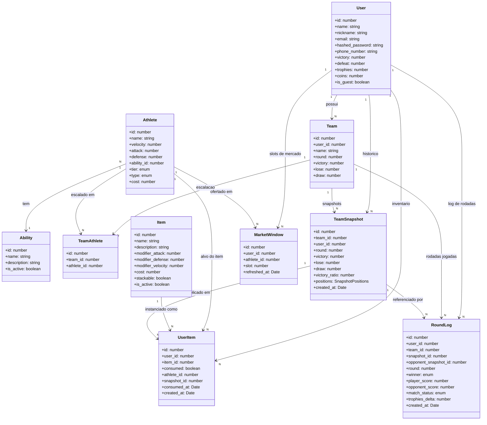

# Diagrama de Classes - AutoSoccer

Modelo de dominio do AutoSoccer extraido de `src/database/models/`. As classes
representam tabelas Sequelize com seus principais atributos e relacionamentos
(cardinalidades inferidas das chaves estrangeiras e das tabelas de juncao).

Resumo das entidades:

- **User** — jogador autenticado (ou convidado) com saldo de moedas e trofeus.
- **Team** — equipe pertencente ao usuario; guarda placar/round da campanha atual.
- **Athlete** — atleta jogavel com stats, tier e tipo (defender/midfielder/attacker).
- **Ability** — habilidade descritiva referenciada por `Athlete`.
- **TeamAthlete** — tabela de juncao N:N entre `Team` e `Athlete`.
- **Item** — item de buff comprado pelo usuario com modificadores de atributos.
- **UserItem** — instancia de item no inventario, com consumo registrado.
- **TeamSnapshot** — fotografia imutavel da formacao da equipe antes da rodada.
- **MarketWindow** — janela de mercado (3 slots) por usuario.
- **RoundLog** — registro imutavel de uma rodada jogada.

## Notas

- `TeamAthlete` materializa N:N entre `Team` e `Athlete` (unique index em
  `team_id + athlete_id`).
- `UserItem` materializa N:N entre `User` e `Item` com payload de consumo:
  guarda em qual `Athlete` e em qual `TeamSnapshot` o buff foi aplicado.
- `TeamSnapshot.positions` e um JSON 3x3 (`SnapshotPositions`) que congela
  atletas + bonus + ancoragem (RN011) no instante anterior ao motor de
  simulacao.
- `RoundLog` referencia dois snapshots distintos: o do jogador e o do
  oponente fantasma escolhido pelo matchmaking (RN006).
