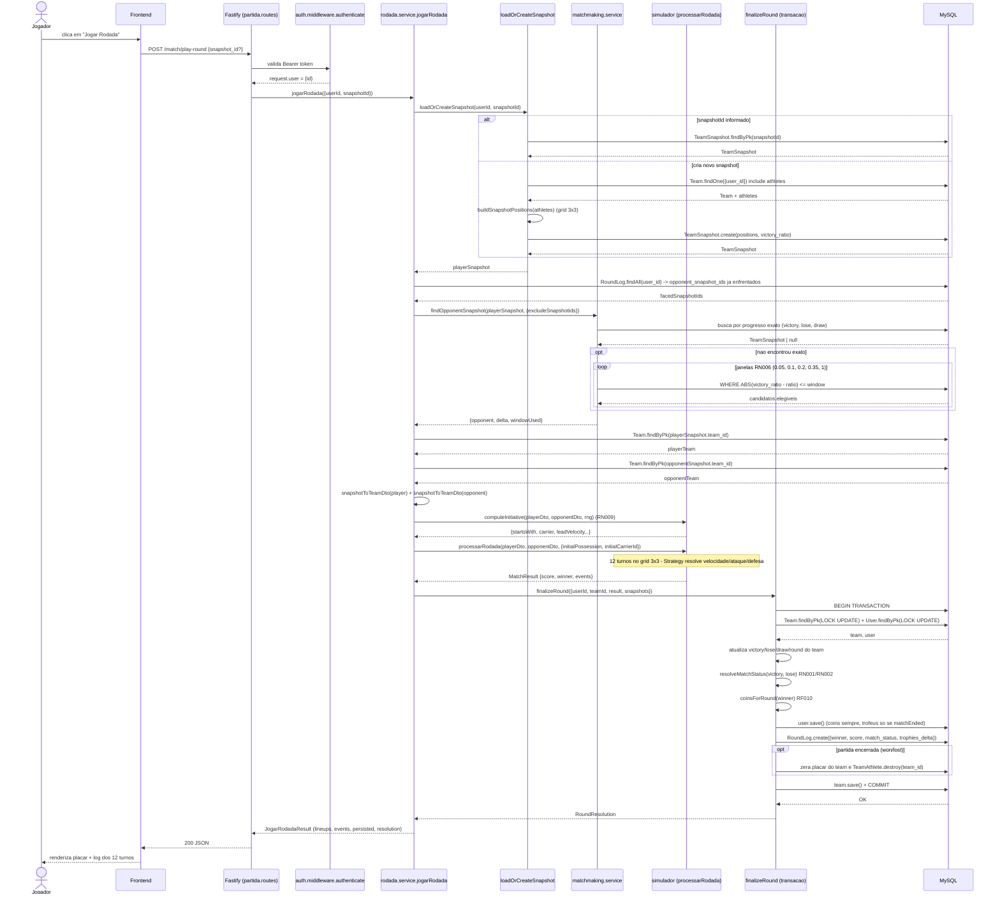

# Diagrama de Sequencia - Jogar Rodada

Fluxo do endpoint `POST /match/play-round` (rota em
`src/modules/partida/partida.routes.ts`, orquestrador em
`src/modules/partida/rodada.service.ts > jogarRodada`). Inclui o
matchmaking RN006 (`matchmaking.service.findOpponentSnapshot`), a iniciativa
RN009 (`simulador.computeInitiative`), o motor de 12 turnos
(`simulador.processarRodada`) e a finalizacao transacional
(`finalizeRound`).

## Notas

- O `request.user.id` vem do JWT decodificado no `authenticate`; o backend
  ignora qualquer `user_id` enviado no body.
- RN006 (matchmaking): primeiro tenta progresso identico
  (`victory + lose + draw`) e, em seguida, alarga janelas progressivas de
  `victory_ratio`; snapshots ja enfrentados pelo jogador entram em
  `excludeSnapshotIds` para evitar adversario repetido.
- RN009 (iniciativa): soma a velocidade da linha mais avancada de cada time;
  empate e desempatado pelo `rng` (injetavel para testes).
- O motor de simulacao (Task 4.2) gera ate 12 turnos no grid 3x3,
  resolvendo cada evento (move/pass/tackle/shot/turnover) com Strategy
  baseada em velocidade/ataque/defesa.
- `finalizeRound` roda em transacao com `LOCK UPDATE` no `User` e no `Team`
  para evitar condicao de corrida no saldo de moedas/trofeus.
- `coins` sao redefinidas (sem acumular) a cada rodada (RF010); `trophies`
  so mudam quando a partida encerra e o usuario nao e convidado (RF004/RF005).
