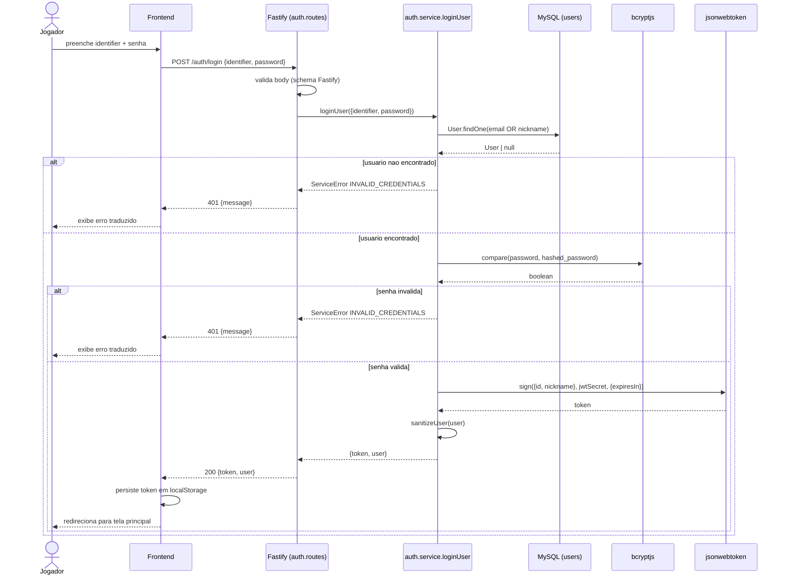

# Diagrama de Sequencia - Login JWT

Fluxo do endpoint `POST /auth/login` (rota em
`src/modules/auth/auth.routes.ts`, servico em `src/modules/auth/auth.service.ts`).
Cobre o caminho feliz e o caminho de credenciais invalidas. A funcao
`loginUser` aceita email ou nickname como `identifier`, compara o hash via
`bcrypt.compare` e gera o token com `jwt.sign` usando o segredo de
`env.jwtSecret`.

## Notas

- O schema do body (`identifier`, `password`) e validado pelo Fastify antes
  de chegar ao service.
- `identifier` aceita email (case-insensitive via `toLowerCase()`) ou
  nickname (case-sensitive); a query usa `Op.or`.
- `sanitizeUser` remove `hashed_password` e demais campos sensiveis do
  payload de resposta.
- Erros usam `ServiceError` com chave i18n
  (`auth.login.invalidCredentials`); o `errorHandler` global traduz pela
  preferencia do `Accept-Language`.
- O JWT carrega apenas `{ id, nickname }` e expira segundo `env.jwtExpiresIn`
  (default `5d` em producao).
